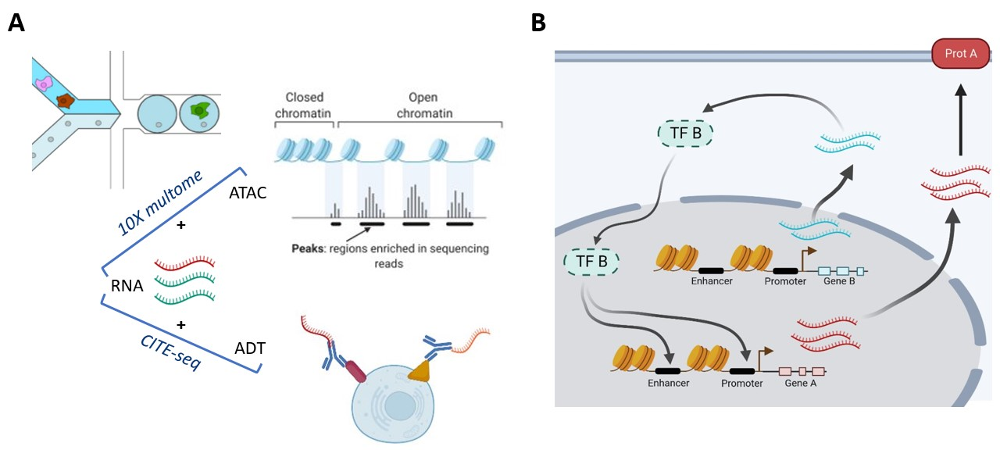
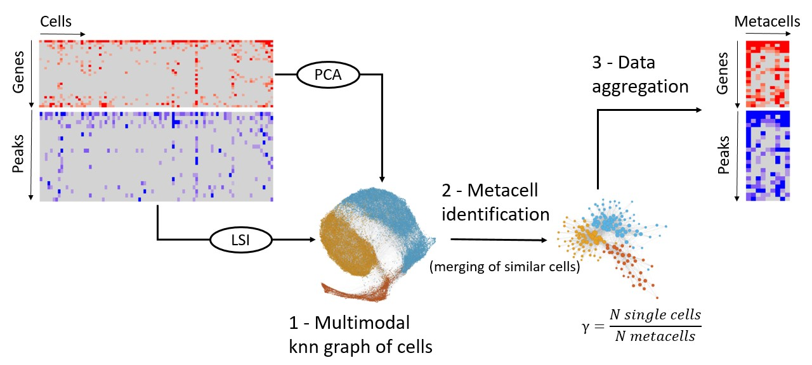

```{=html}
<style>
#main-img-left {
 width: 13%;
}
#main-img-center {
 width: 10%;
}
#main-img-right {
 width: 13%;
}
</style>
```
```{r, include=FALSE}
knitr::opts_chunk$set(echo = FALSE,
                      warning = FALSE,
                      tidy = FALSE,
                      message = FALSE,
                      fig.align = 'center',
                      out.width = "100%")
options(knitr.table.format = "html") 

library(ggplot2)
```

# Introduction

-   Single-cell multiomics: measurement of different modalities (e.g., ATAC, RNA, proteins) in the same cell (Fig.\@ref(fig:benchmark)A)
-   Precise analysis of cell-type specific transcriptional regulation (Fig.\@ref(fig:benchmark)B).

```{r, include=FALSE}
knitr::write_bib(c('posterdown', 'rmarkdown','pagedown'), 'packages.bib')
```

```{r}
library(ggplot2)
```

```{r intro, fig.cap= 'Single-cell multiomics (A) can be used to study cell-type specific transcriptional regulation (B)'}


```

-   **Limitations:** Large size, high sparsity of the data.
-   **Solution:** Merging highly similar cells in metacells, proposed for scRNA-seq [@baran_metacell_2019].
-   **Aim:** Extension of `SuperCell` [@bilous_metacells_2022-1], to single-cell multiomics. (Fig.\@ref(fig:workflow)B).

```{r workflow, fig.cap= 'SuperCell workflow to identify multiomics metacells at a graining level γ. The multimodal knn graph is computed using the WNN method from Seurat [@hao_integrated_2021].'}


```

# Benchmark

Multiomodal version of `SuperCell` versus unimodal tools (Fig.\@ref(fig:benchmark)):

-   Purer metacells
-   Compact and separated metacells in both modalities
-   Faster

```{r benchmark,  fig.cap= '**A** Benchmark metrics. **B** Benchmark results of metacell tools on a 10x multiome (RNA + ATAC) dataset of PBMC, graining level γ=75. Tools: new version of SuperCell, SEACells [@persad_seacells_2022], MetaCell2 [@ben-kiki_divide_2021].' }
metrics.fig <- cowplot::ggdraw() + cowplot::draw_image(image = "images/metrics_vertical_cropped.jpg", scale = 1) 


bench_plot <- readRDS("bench_plot.rds")


cowplot::plot_grid(metrics.fig,bench_plot,labels = c('A','B'),ncol = 2,rel_widths  = c(0.2,0.5))

```

# SuperCell Analyses

### 10X multiome dataset of PBMCs

`SuperCell` identifies robust metacells in the PBMC multiomic space (Fig.\@ref(fig:pbmcmulti)).

```{r pbmcmulti, echo=FALSE, fig.cap='Identified metacells in the multiomic space of PBMCs, graining level γ = 75', fig.height=7}

umapMultiSC <- readRDS("multiome_umapmc.rds")
umapMultiSC 
```

Gene accessibility and expression appear more correlated at the metacell level (Fig.\@ref(fig:crMultiome)).

```{r crMultiome, echo=FALSE, fig.cap='**A**. Gene accessibility - gene expression correlation for TCF7 and SPI1. Left: Single-cell level, right: metacell γ = 75. Same color legend as in Fig.\\@ref(fig:pbmcmulti). **B**. Same correlations for the 2000 highly variable genes (on RNA) with increasing γ.', fig.height=5}
cr.rna.atac.plot <- readRDS("cr.rna.atac.plot.rds")

cr.rna.atac.plot
```

Correlation between transcription factor (TF) expression and corresponding motif accessibility also becomes clearer using metacells (Fig.\@ref(fig:crMotifRna)).

```{r, crMotifRna, fig.cap= '**A.** TF expression (RNA) - motif accessibility (ATAC) correlation for TCF7 and SPI1. Left: single-cell, right: metacells, γ = 75. Same color legend as in  Fig.\\@ref(fig:pbmcmulti). **B.** Same correlations for 200 TFs (with cor > 0.01 in single-cells) with increasing γ.', fig.height=5}
cr.rna.motif.plot <- readRDS("cr.rna.motif.plot.rds")
cr.rna.motif.plot
```

\

### CITE-seq atlas of 160,000 PBMCs

-   Identification of metacells by sample (γ = 20)
-   Correction of the batch effect at the metacell level (Fig.\@ref(fig:citeAtlas)A&B).
-   This workflow runs on a standard laptop (Fig.\@ref(fig:citeAtlas)C).

```{r citeAtlas, echo=FALSE, fig.cap='**A.** UMAP visualizations of 8,000 multiomic metacells, metacell purities  with respect to original annotation from [@hao_integrated_2021]. **B.** Metacell workflow. **C.** Computational resources used by single-cell and metacell workflows.', fig.height=6}

cite.atlas.umaps.purity.plot <- readRDS("cite.atlas.umaps.purity.plot.rds")

cite.atlas.umaps.purity.plot <-  cowplot::plot_grid(cite.atlas.umaps.purity.plot,labels = "A")

ressources.plot <- readRDS("ressources.plot.rds")

cite.atlas.workflow <- cowplot::ggdraw() + cowplot::draw_image(image = "images/citeAtlasWorkflow.jpg", scale = 0.9)

citeAtlasBC <- cowplot::plot_grid(
  cite.atlas.workflow,
  ressources.plot,
  labels = c("B","C"),rel_widths = c(0.6,0.4)
)

cowplot::plot_grid(cite.atlas.umaps.purity.plot,citeAtlasBC,ncol = 1,rel_heights = c(0.55,0.45))
```

RNA-protein correlation in the CITE-seq atlas is increased with metacells (Fig.\@ref(fig:globalCrCiteSeq)).

```{r, globalCrCiteSeq, fig.cap='**A.** RNA-protein correlation for CD55 and CD19. Left: Single-cell level, right: metacell γ = 75 Same color legend as in Fig.\\@ref(fig:citeAtlas). **B.** RNA-Protein correlation for 213 gene-protein pairs with increasing γ'}
cr.rna.prot.plot <- readRDS("cr.rna.prot.plot.rds")
cr.rna.prot.plot
```

# Conclusion

```{r conclusion,fig.height=1}
knitr::include_graphics('images/conclusion.jpg')

```

## Perspectives

-   **Downstream analyses** of sc-multiomics:
    -   gene regulatory network inference
    -   multiomic velocity
-   **Metaspots** for spatial-omics

### References
