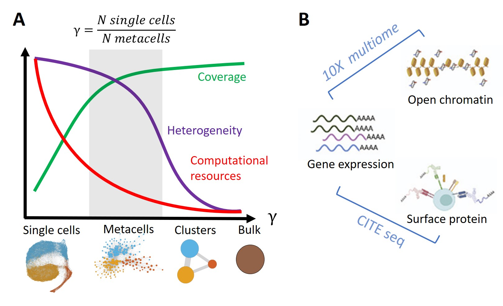
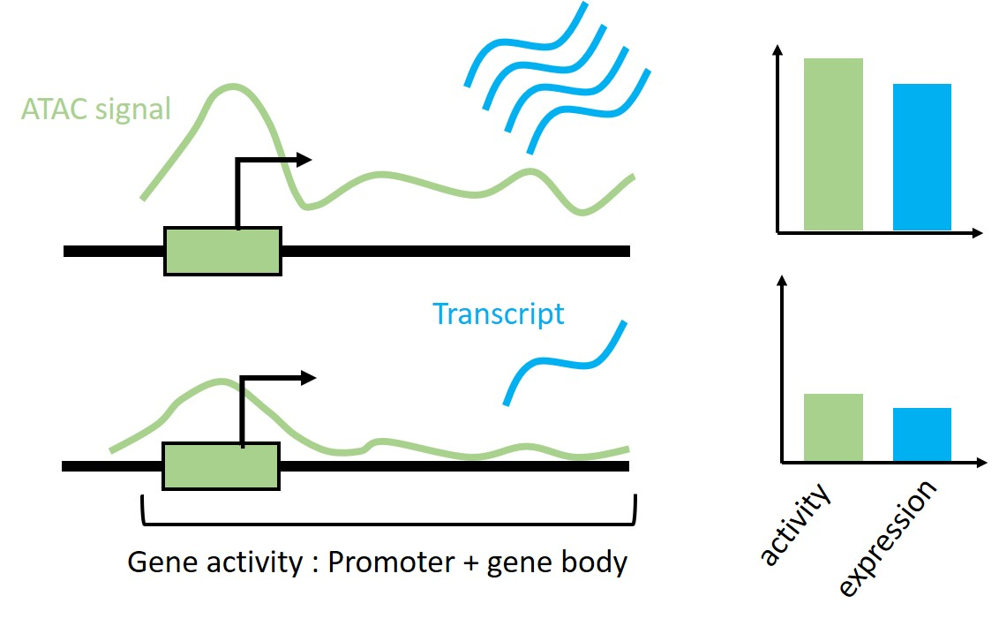

```{r, include=FALSE}
knitr::opts_chunk$set(echo = FALSE,
                      warning = FALSE,
                      tidy = FALSE,
                      message = FALSE,
                      fig.align = 'center',
                      out.width = "100%")
options(knitr.table.format = "html") 

library(ggplot2)
```


# Introduction
The increased throughput of single-cell omics technologies enables researchers to study cell type-specific gene regulation at an unprecedented resolution. These promises depend on the development of computational methods to cope with both large size and the high sparsity of these data. Thus, we and others developed methods to identify metacells, disjoint and homogeneous groups of cells, in scRNA-seq data [@baran_metacell_2019,@bilous_metacells_2022-1]. We are now developing a new version of our method **SuperCell** to identify metacells in single-cell multiomics (sc-multiomics) data that combine the measurement of different types of molecules (modalities) in the same single-cell.  


```{r, include=FALSE}
knitr::write_bib(c('posterdown', 'rmarkdown','pagedown'), 'packages.bib')
```

```{r FigureIntro,  out.width="80%"}


```
```{r fig.cap='Metacell concept (A) and examples sc-multiomics data (B)'}
library(ggplot2)
```


# Methods

For sc-multiomics, Supercell used a weighted Nearest Neighbor (wNN) graph  [@hao_integrated_2021]), on which the metacell are identified. Single-cell raw data from each modality are aggregated per metacells that can be used for downstream analyses.
```{r FigureMethod}
knitr::include_graphics('images/FigureMethod.jpg')

```


## Datasets

* 10X multiome data of Peripheral Blood Mononuclear cells (PBMCs) : scRNA-seq & ATAC-seq (12'000 cells). We analysed the correlation between gene expression and gene activity.
* CITE-seq data of Bone marrow cells: scRNA-seq & 25 protein levels (30'000 cells). We analysed the correlation between gene expression and corresponding protein level.

```{r FigureActivity, out.width="70%"}


```
  

# Results

### 10X multiome dataset of pbmc
SuperCell identified robuste metacell in multiomic space of PBMC cells (Fig.\@ref(fig:pbmcmulti)).
```{r pbmcmulti, echo=FALSE, fig.cap='identified metacell in the multimomic space of PBMCs'}

umapMultiSC <- readRDS("multiome_umapmc.rds")
umapMultiSC 
```
\

Gene activity and expression for key TF of lymphoid cells (TCF7) and myeloid cells (SPI1) appeared more correlated at the metacell level (Fig.\@ref(fig:crMultiomeKey)).

```{r crMultiomeKey, echo=FALSE, fig.cap='gene expression-activity correlation for key TF of immune cells'}
multiomeCr <- readRDS("crPLotMultiome.rds")

cowplot::plot_grid(multiomeCr)
```
\

Analysis of this correlation for the most variable genes at the transcriptomic level (top 2000) show the same trend (Fig.\@ref(fig:globalCrMultiome)).

```{r, globalCrMultiome, fig.cap='Global gene expression-activity correlation'}
globalCr <- readRDS("globalCrPLotMultiome.rds")
globalCr
```

\
\
\
\

### CITE-seq dataset of BM cells
SuperCell identified robuste metacell in CITE-seq space of BM cells (Fig.\@ref(fig:bmcite)).

```{r bmcite, echo=FALSE, fig.cap='identyfied metacell in the multimodal single cell CITE-seq space of bone marrow cells'}

umapMultiSC <- readRDS("bmcite_umapmc.rds")
umapMultiSC + guides(fill=guide_legend(ncol=2))
```
\
Metacell analysis increase the correlation between RNA and protein level of key markers of HSC (CD34) and CD8 T cells (CD8A) Fig.\@ref(fig:crBmKey).

```{r crBmKey, echo=FALSE, fig.cap='RNA protein correlations for key markers of BM cells', out.width="90%"}
crBmKey <- readRDS("crCiteSeq.rds")

cowplot::plot_grid(crBmKey)
```

\
The analysis of the RNA-protein correlation for the all 25 gene-protein couples exhibits the same trend Fig.\@ref(fig:globalCrCiteSeq).

```{r, globalCrCiteSeq, fig.cap='Global RNA-Protein correlations'}
globalCr <- readRDS("globalCrCiteSeq.rds")
globalCr
```


# References
