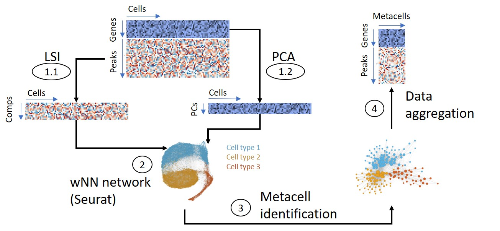

<style>
#main-img-left {
 width: 13%;
}
#main-img-center {
 width: 10%;
}
#main-img-right {
 width: 13%;
}
</style>

```{r, include=FALSE}
knitr::opts_chunk$set(echo = FALSE,
                      warning = FALSE,
                      tidy = FALSE,
                      message = FALSE,
                      fig.align = 'center',
                      out.width = "100%")
options(knitr.table.format = "html") 

library(ggplot2)
```


# Introduction
The increased throughput of single-cell omics technologies allows researchers to study cell-type specific gene regulation at unprecedented resolution. This promise depends on the development of computational methods to cope with both the large size and the high sparsity of these data. Thus, we and others have developed approaches to identify metacells, disjoint and homogeneous groups of cells, in scRNA-seq data [@baran_metacell_2019;@bilous_metacells_2022-1]. We are now extending our `SuperCell` method to identify metacells in single-cell multiomics (sc-multiomics) data that combines the measurement of different types of molecules (modalities) in the same single cell.


```{r, include=FALSE}
knitr::write_bib(c('posterdown', 'rmarkdown','pagedown'), 'packages.bib')
```

```{r FigureIntro,  out.width="80%"}
knitr::include_graphics('images/FigureIntro.png.jpg')

```
```{r fig.cap='Metacell concept (A) and examples sc-multiomics data (B)'}
library(ggplot2)
```


# Methods

For sc-multiomics, our new `SuperCell` workflow identifies metacells on a weighted Nearest Neighbor (wNN) graph [@hao_integrated_2021]. Single-cell raw data from each modality are aggregated per metacells that can be used for downstream analyses.
```{r FigureMethod}


```


## Datasets

* *10X multiome* data of peripheral blood mononuclear cells (PBMCs): scRNA-seq & ATAC-seq (10'000 cells). We analyzed the correlation between gene expression and activity.
* CITE-seq data from bone marrow (BM) cells: scRNA-seq & 25 protein levels (30'000 cells). We analyzed the correlation between gene expression and the corresponding protein level.

```{r FigureActivity, out.width="70%"}
knitr::include_graphics('images/FigureActivity.jpg')

```
  

# Results

### 10X multiome dataset of PBMCs
`SuperCell` identified robust metacells in the multiomic space of PBMCs. (Fig.\@ref(fig:pbmcmulti)).

```{r pbmcmulti, echo=FALSE, fig.cap='identified metacells in the multimomic space of PBMCs.', fig.height=6, out.width="80%"}

umapMultiSC <- readRDS("multiome_umapmc.rds")
umapMultiSC 
```
\

Gene activity and expression for key Transcription Factors TFs of lymphoid cells (TCF7) and myeloid cells (SPI1) appeared more correlated at the metacell level (Fig.\@ref(fig:crMultiomeKey)).

```{r crMultiomeKey, echo=FALSE, fig.cap='gene expression-activity correlation for key TFs of immune cells. Single-cell level, gamma 20 and gamma 50 from left to right.'}
multiomeCr <- readRDS("crPLotMultiome.rds")

cowplot::plot_grid(multiomeCr)
```
\

Analysis of this correlation for the most variable genes at the transcriptomic level (top 2000) showed the same trend (Fig.\@ref(fig:globalCrMultiome)).

```{r, globalCrMultiome, fig.cap='Gene expression-activity correlation for 2000 genes at different gammas. The dataset was subsampled at each gamma for comparison.'}
globalCr <- readRDS("globalCrPLotMultiome.rds")
globalCr
```

\
\
\
\
\

### CITE-seq dataset of BM cells
`SuperCell` identified robust metacell in the CITE-seq space of BM cells (Fig.\@ref(fig:bmcite)).

```{r bmcite, echo=FALSE, fig.cap='Identified metacell in the CITE-seq space of BM cells', fig.height=6, out.width="80%"}

umapMultiSC <- readRDS("bmcite_umapmc.rds")
umapMultiSC + guides(fill=guide_legend(ncol=2))
```
\
Metacell analysis increased the correlation between RNA and protein levels of key markers of HSCs (CD34) and CD8 T cells (CD8A, Fig.\@ref(fig:crBmKey)).

```{r crBmKey, echo=FALSE, fig.cap='RNA protein correlations for key markers of BM cells. Single-cell level, gamma 20 and gamma 50 from left to right.'}
crBmKey <- readRDS("crCiteSeq.rds")

cowplot::plot_grid(crBmKey)
```

\
RNA-protein correlation analysis for the 25 gene-protein pairs exhibited the same trend (Fig.\@ref(fig:globalCrCiteSeq)).

```{r, globalCrCiteSeq, fig.cap='RNA-Protein correlation for all gene-protein pairs. Random metacells were defined at each gamma for comparison.'}
globalCr <- readRDS("globalCrCiteSeq.rds")
globalCr
```


# References
